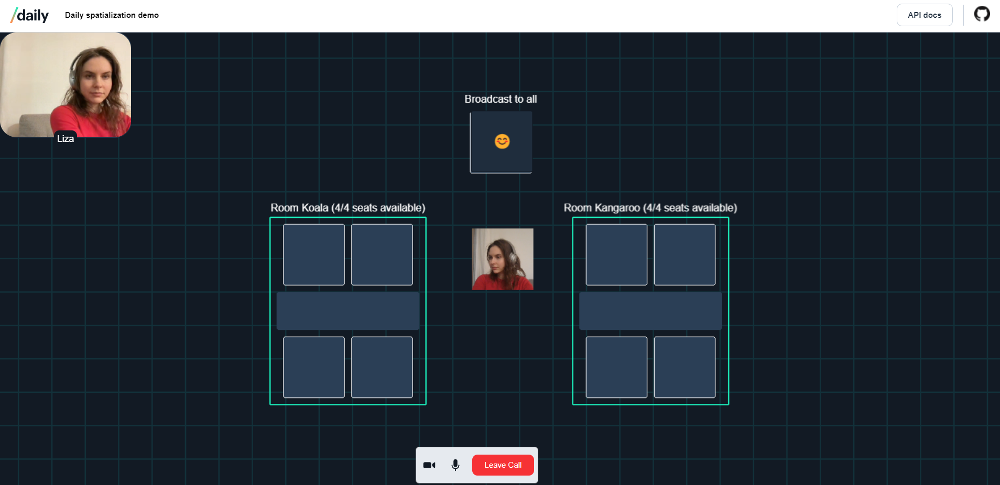

# Daily spatialization demo

This demo shows one way to implement a video and audio call application with gamified spatialization elements using [Daily's call object](https://docs.daily.co/guides/products/call-object).

## Getting set up with Daily

To use this demo, you will need a Daily room to join.

To get a Daily room URL, [create a Daily account](https://dashboard.daily.co/signup)

Once you have an account and are logged into the [Daily Dashboard](https://dashboard.daily.co/), you can [create a new Daily room](https://dashboard.daily.co/rooms/create).

Copy the new room's URL. You can use this in the form on the home page.

The room URL will be in the following format:

`https://<your-daily-domain>.daily.co/<room-name>`

## How the demo works

This demo uses Daily's `app-message` events to broadcast each user's position to other users in a 2D top-down world. Users navigate by using arrow keys or WASD.

When traversing the world, users hear and see each other as they get closer. The world contains a "broadcast" spot which allows a user to display their audio and video to everyone in the room regardless of their proximity.

The world also contains desks with limited seating spots which users can occupy to gather in smaller groups within the same call. When sitting at a desk, zonemates' video feeds are shown inside larger, draggable video elements on the page.

The demo prompts the user to enter the URL of the Daily room they want to join, and the name they'd like to use.

## Running locally

1. Install dependencies `npm i`
2. Run `npm run build`
3. Run `npm run start`

## Contributing and feedback

Let us know how experimenting with this demo goes! Feel free to reach out to us any time at `help@daily.co`.
